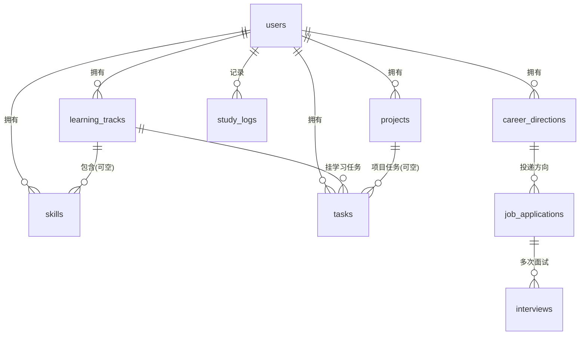

# Miglore OS — 数据库设计 (ER Model)

> 本文件只设计 ER 模型，**不执行 SQL**。V1 目标库：`miglore_os`（独立于生产库，不触碰生产数据）。

## 1. 简化决策（先想清楚，再建表）

初始候选 11 张表，V1 收敛为 **9 张**：

| 候选表 | 决策 | 理由 |
|---|---|---|
| `learning_tasks` | ❌ **并入 `tasks`** | 学习任务与日常/项目任务结构几乎一致（标题/状态/截止/备注），用 `type` 字段区分，避免三张重复表 |
| `project_tasks` | ❌ **并入 `tasks`** | 同上，`tasks.project_id` 可空外键即可覆盖 |
| `career_directions` | ✅ 保留 | 投递方向是求职主线的根节点 |
| 其余 8 张 | ✅ 保留 | 均为核心实体 |

**最终 9 张表：**

```
users, learning_tracks, skills, tasks, career_directions,
job_applications, interviews, projects, study_logs
```

## 2. ER 图 (Mermaid)



### ASCII 版

```
                        users
        ┌──────────┬─────┼─────┬───────────┬────────────┐
        │          │     │     │           │            │
   learning     skills  tasks projects  study_logs  career_directions
    _tracks        │      │     │                        │
        │          │      │     │                        │
        └──────────┘      │     └────────────────────────┘
            (track_id)    │        (project_id 可空)
                          │
                     tasks.type = 'learning' | 'project' | 'daily'
                          │
              job_applications
                          │
                    interviews
```

## 3. 表定义

> 约定：主键一律 `id BIGINT UNSIGNED AUTO_INCREMENT`；所有外键均建立索引；时间戳 `created_at`/`updated_at`（DATETIME, 默认 CURRENT_TIMESTAMP, ON UPDATE）；软删除统一用 `deleted_at DATETIME NULL`（不做物理删除，保留历史）。

### 3.1 `users` — 用户

| 字段 | 类型 | 说明 |
|---|---|---|
| id | PK | 主键 |
| username | varchar(50) UNIQUE | 登录名 |
| email | varchar(100) UNIQUE | 邮箱 |
| password_hash | varchar(255) | bcrypt |
| display_name | varchar(50) | 显示名（默认=username） |
| avatar_url | varchar(255) NULL | 头像 |
| career_goal | varchar(255) NULL | **首页 Hero 用的职业目标**（如 "DevOps 工程师"） |
| created_at / updated_at | DATETIME | 时间戳 |

**索引**：`username`(UNIQUE), `email`(UNIQUE)

### 3.2 `learning_tracks` — 学习路线

用途：一条完整的学习路线（如「DevOps 学习计划」：阶段一基础 → 阶段二 Lab → 阶段三容器 → …）。

| 字段 | 类型 | 说明 |
|---|---|---|
| id | PK | 主键 |
| user_id | FK → users.id | 属主 |
| title | varchar(100) | 路线名 |
| description | text NULL | 描述/目标 |
| status | enum('active','paused','completed') | 状态，默认 active |
| progress | int 0-100 | 路线整体进度（由子任务聚合，可冗余缓存） |
| started_at | DATETIME NULL | 开始日期 |
| sort_order | int | 排序 |

**关系**：users 1—N learning_tracks；learning_tracks 1—N skills（可空）；learning_tracks 1—N tasks
**索引**：`user_id`, `(user_id, status)`

### 3.3 `skills` — 技能

用途：技能清单，归属某条路线（可空 = 独立技能）。

| 字段 | 类型 | 说明 |
|---|---|---|
| id | PK | 主键 |
| user_id | FK → users.id | 属主 |
| track_id | FK → learning_tracks.id NULL | 所属路线（可空） |
| name | varchar(50) | 技能名（如 Nginx, Docker） |
| level | tinyint 1-5 | 自评熟练度 |
| target_level | tinyint 1-5 | 目标熟练度 |
| status | enum('learning','learned','idle') | 状态 |

**关系**：users 1—N skills；learning_tracks 1—N skills
**索引**：`user_id`, `track_id`

### 3.4 `tasks` — 任务（统一表，V1 核心简化）

用途：**一张表覆盖三类任务**——`type='learning'`（学习任务）、`type='project'`（项目任务）、`type='daily'`（日常/今日待办）。

| 字段 | 类型 | 说明 |
|---|---|---|
| id | PK | 主键 |
| user_id | FK → users.id | 属主 |
| type | enum('learning','project','daily') | 任务类型 |
| title | varchar(200) | 任务标题 |
| description | text NULL | 备注 |
| status | enum('todo','in_progress','done','cancelled') | 状态 |
| priority | tinyint 1-3 | 优先级（3=高） |
| due_date | DATE NULL | 截止日 |
| track_id | FK → learning_tracks.id NULL | 仅 learning 类 |
| skill_id | FK → skills.id NULL | 仅 learning 类 |
| project_id | FK → projects.id NULL | 仅 project 类 |
| completed_at | DATETIME NULL | 完成时间 |
| sort_order | int | 排序 |

**关系**：users 1—N tasks；learning_tracks 1—N tasks；projects 1—N tasks；skills 1—N tasks
**索引**：`user_id`, `(user_id, status)`, `(user_id, due_date)`, `project_id`, `track_id`
> 查询模式：今日任务 = `user_id + due_date=today + status!=done`；学习任务 = `user_id + type=learning + track_id`

### 3.5 `career_directions` — 投递方向

用途：求职方向（如 DevOps/运维开发、SRE、云原生），是投递记录的根节点。

| 字段 | 类型 | 说明 |
|---|---|---|
| id | PK | 主键 |
| user_id | FK → users.id | 属主 |
| name | varchar(100) | 方向名 |
| description | text NULL | 目标岗位描述 |
| status | enum('active','paused','closed') | 状态 |
| target_role | varchar(100) NULL | 目标职位 |
| sort_order | int | 排序 |

**关系**：users 1—N career_directions；career_directions 1—N job_applications
**索引**：`user_id`, `(user_id, status)`

### 3.6 `job_applications` — 投递记录

用途：每次投递（公司/岗位/渠道/状态）。

| 字段 | 类型 | 说明 |
|---|---|---|
| id | PK | 主键 |
| user_id | FK → users.id | 属主 |
| direction_id | FK → career_directions.id NULL | 所属方向 |
| company | varchar(100) | 公司 |
| position | varchar(100) | 岗位 |
| channel | varchar(50) NULL | 渠道（BOSS直聘/内推/官网…） |
| url | varchar(500) NULL | 岗位链接 |
| status | enum('draft','applied','interviewing','offer','rejected','withdrawn') | 状态 |
| applied_at | DATE NULL | 投递日期 |
| note | text NULL | 备注 |

**关系**：users 1—N；career_directions 1—N；job_applications 1—N interviews
**索引**：`user_id`, `(user_id, status)`, `direction_id`, `applied_at`

### 3.7 `interviews` — 面试记录

用途：一次投递的多轮面试（一面/二面/HR面…）。

| 字段 | 类型 | 说明 |
|---|---|---|
| id | PK | 主键 |
| user_id | FK → users.id | 属主 |
| application_id | FK → job_applications.id | 所属投递 |
| round | varchar(30) | 轮次（一面/二面/HR面/笔试…） |
| scheduled_at | DATETIME NULL | 面试时间 |
| interviewer | varchar(100) NULL | 面试官 |
| result | enum('pending','passed','failed','offered') | 结果 |
| review | text NULL | 复盘（问了什么/答得如何/改进点） |
| note | text NULL | 备注 |

**关系**：users 1—N；job_applications 1—N interviews
**索引**：`user_id`, `application_id`, `(application_id, scheduled_at)`

### 3.8 `projects` — 项目

用途：个人项目（Miglore OS 本身、devops-lab、高济帮助台自动化等）。

| 字段 | 类型 | 说明 |
|---|---|---|
| id | PK | 主键 |
| user_id | FK → users.id | 属主 |
| name | varchar(100) | 项目名 |
| description | text NULL | 简介 |
| tech_stack | varchar(255) NULL | 技术栈标签（逗号分隔） |
| repo_url | varchar(500) NULL | 仓库链接 |
| status | enum('planning','active','paused','done','archived') | 状态 |
| progress | int 0-100 | 进度 |
| start_date / end_date | DATE NULL | 起止 |
| featured | tinyint 0/1 | **首页 Featured Projects 标记** |

**关系**：users 1—N projects；projects 1—N tasks
**索引**：`user_id`, `(user_id, featured)`, `(user_id, status)`

### 3.9 `study_logs` — 学习日志

用途：每日学习记录（学了什么/时长/心得），构成 Journal 时间线。

| 字段 | 类型 | 说明 |
|---|---|---|
| id | PK | 主键 |
| user_id | FK → users.id | 属主 |
| log_date | DATE | 日志日期 |
| content | text | 学了什么（Markdown 支持） |
| duration_min | int NULL | 时长(分钟) |
| mood | tinyint 1-5 NULL | 状态分（可选） |
| track_id | FK → learning_tracks.id NULL | 关联路线（可选） |
| project_id | FK → projects.id NULL | 关联项目（可选） |

**关系**：users 1—N study_logs；learning_tracks 1—N（可空）；projects 1—N（可空）
**索引**：`user_id`, `(user_id, log_date)`, `track_id`, `project_id`

## 4. 关系汇总

| 关系 | 类型 | 通过 |
|---|---|---|
| users → learning_tracks / skills / tasks / projects / study_logs / career_directions | 1—N | user_id |
| learning_tracks → skills / tasks | 1—N | track_id |
| skills → tasks | 1—N | skill_id |
| projects → tasks | 1—N | project_id |
| career_directions → job_applications | 1—N | direction_id |
| job_applications → interviews | 1—N | application_id |

**多对多说明**：V1 刻意**不引入多对多中间表**。技能-路线、任务-项目/路线均用「可空外键」表达，语义简单、查询直接。若未来出现"一个技能属于多条路线"的真实需求，再加 `track_skills` 中间表迁移（V1 不做）。

## 5. 索引清单（汇总）

```
users:               UNIQUE(username), UNIQUE(email)
learning_tracks:     idx(user_id), idx(user_id,status)
skills:              idx(user_id), idx(track_id)
tasks:               idx(user_id), idx(user_id,status), idx(user_id,due_date),
                     idx(project_id), idx(track_id)
career_directions:   idx(user_id), idx(user_id,status)
job_applications:    idx(user_id), idx(user_id,status), idx(direction_id), idx(applied_at)
interviews:          idx(user_id), idx(application_id), idx(application_id,scheduled_at)
projects:            idx(user_id), idx(user_id,featured), idx(user_id,status)
study_logs:          idx(user_id), idx(user_id,log_date), idx(track_id), idx(project_id)
```

## 6. 迁移策略

- 迁移工具：Alembic（Flask-Migrate），schema 版本化，全部在 dev 库执行
- 生产库 `miglore`（users/resumes/api_tokens）**保持不动**；V1 完成后再评估用户数据迁移/共存方案
